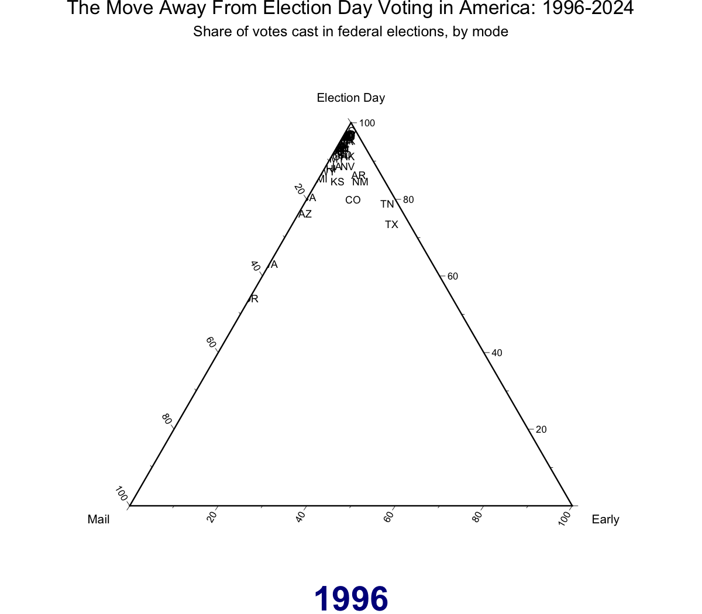

```{r, include = FALSE, echo = FALSE}
options(rmarkdown.html_vignette.check_title = FALSE)
NOT_CRAN <- identical(tolower(Sys.getenv("NOT_CRAN")), "true")
ON_GITHUB <- nzchar(Sys.getenv("GITHUB_ACTIONS"))
knitr::opts_chunk$set(
  collapse = TRUE,
  comment = "#>",
  message = FALSE, warning = FALSE,
  purl = NOT_CRAN,
  eval = NOT_CRAN && !ON_GITHUB
)
library(knitr)
library(cpsvote)
```

```{r eval = FALSE}
library(cpsvote)
```

```{r packages, message = FALSE, warning = FALSE}
library(tidyverse)
library(here)
library(dplyr)
library(srvyr)
library(tweenr)
library(ggtern)
library(rlang)
library(magick)
```

In 1996, the first year the Current Population Survey asked about voting method, 89% of Americans cast their ballot in person on Election Day. By 2020, that figure had fallen to 31% — a drop of nearly 60 percentage points in a quarter century. Early in-person voting and voting by mail have filled the gap, with distinct regional patterns driving the change.

This vignette presents an animated **ternary plot** of this shift. A ternary plot uses three axes — here, Election Day voting, early in-person voting, and vote by mail — that together sum to 100%. Each state is a point, and the animation moves year by year from 1996 to 2024, showing how the distribution of voting methods has evolved across the country.

## Data preparation

```{r load-data}
cps <- cps_load_basic(datadir = here::here('cps_data'))
```

```{r vote-mode-data}
# To highlight one or more states, set highlight_states to a character vector
# of two-letter postal abbreviations. Highlighted states will appear in
# highlight_color; all other states will be black. When exactly one state is
# highlighted, a trail is drawn showing that state's path through the ternary
# space over time.
#
# Example — track Oregon:
#   highlight_states <- c("OR")
#
# Example — highlight several Western vote-by-mail states:
#   highlight_states <- c("OR", "WA", "CO")
#
# Leave as c() for no highlighting (all states shown in black).
highlight_states <- c()
highlight_color  <- "red"

cps_weighted <- cps %>%
  filter(YEAR > 1995) %>%
  srvyr::as_survey_design(weights = turnout_weight)

vote_mode <- cps_weighted %>%
  select(YEAR, STATE, VRS_VOTEMETHOD_CON) %>%
  filter(if_all(everything(), ~ !is.na(.x))) %>%
  group_by(YEAR, STATE, VRS_VOTEMETHOD_CON) %>%
  summarize(survey_mean(na.rm = TRUE)) %>%
  select(-ends_with('_se')) %>%
  pivot_wider(id_cols = c("YEAR", "STATE"),
              names_from = "VRS_VOTEMETHOD_CON",
              values_from = "coef",
              values_fill = 0)
```

## Generating the animation

The animation works by interpolating smoothly between each election year using the `tweenr` package. For each transition, 10 frames are generated; states hold their position for another 10 frames before the next transition begins. Each frame is saved as a PNG, then the full sequence is assembled into a GIF using `magick`.

Note: this chunk takes approximately 5 minutes to run.

```{r animate, results = 'hide'}
tweened_data <- filter(vote_mode, YEAR == 1996) %>%
  keep_state(10) %>%
  tween_state(filter(vote_mode, YEAR == 1998), 'linear', id = STATE, nframes = 10) %>%
  keep_state(10) %>%
  tween_state(filter(vote_mode, YEAR == 2000), 'linear', id = STATE, nframes = 10) %>%
  keep_state(10) %>%
  tween_state(filter(vote_mode, YEAR == 2002), 'linear', id = STATE, nframes = 10) %>%
  keep_state(10) %>%
  tween_state(filter(vote_mode, YEAR == 2004), 'linear', id = STATE, nframes = 10) %>%
  keep_state(10) %>%
  tween_state(filter(vote_mode, YEAR == 2006), 'linear', id = STATE, nframes = 10) %>%
  keep_state(10) %>%
  tween_state(filter(vote_mode, YEAR == 2008), 'linear', id = STATE, nframes = 10) %>%
  keep_state(10) %>%
  tween_state(filter(vote_mode, YEAR == 2010), 'linear', id = STATE, nframes = 10) %>%
  keep_state(10) %>%
  tween_state(filter(vote_mode, YEAR == 2012), 'linear', id = STATE, nframes = 10) %>%
  keep_state(10) %>%
  tween_state(filter(vote_mode, YEAR == 2014), 'linear', id = STATE, nframes = 10) %>%
  keep_state(10) %>%
  tween_state(filter(vote_mode, YEAR == 2016), 'linear', id = STATE, nframes = 10) %>%
  keep_state(10) %>%
  tween_state(filter(vote_mode, YEAR == 2018), 'linear', id = STATE, nframes = 10) %>%
  keep_state(10) %>%
  tween_state(filter(vote_mode, YEAR == 2020), 'linear', id = STATE, nframes = 10) %>%
  keep_state(10) %>%
  tween_state(filter(vote_mode, YEAR == 2022), 'linear', id = STATE, nframes = 10) %>%
  keep_state(10) %>%
  tween_state(filter(vote_mode, YEAR == 2024), 'linear', id = STATE, nframes = 10) %>%
  keep_state(10) %>%
  mutate(YEAR = floor(YEAR / 2) * 2,
         check2 = `ELECTION DAY` + `BY MAIL` + EARLY,
         highlight = STATE %in% highlight_states)

dir.create(here('img', 'plot_frames'), showWarnings = FALSE)

trail_data <- if (length(highlight_states) == 1) {
  tweened_data %>%
    ungroup() %>%
    filter(STATE == highlight_states[1]) %>%
    select(.frame, `ELECTION DAY`, `BY MAIL`, EARLY)
} else {
  NULL
}

for (frame in unique(tweened_data$.frame)) {
  p <- ggplot(filter(tweened_data, .frame == frame),
              aes(y = `ELECTION DAY`, x = `BY MAIL`, z = EARLY,
                  label = STATE, colour = highlight)) +
    geom_text(vjust = 0.5, hjust = 0.5, size = 3, position = "identity") +
    scale_colour_manual(values = c("FALSE" = "black", "TRUE" = highlight_color),
                        guide = "none") +
    coord_tern() +
    labs(x = "Mail",
         y = "Election Day",
         z = "Early",
         title = "The Move Away From Election Day Voting in America: 1996-2024",
         subtitle = "Share of votes cast in federal elections, by mode",
         tag = as.character(unique(filter(tweened_data, .frame == frame)$YEAR))) +
    theme_classic() +
    theme(plot.title = element_text(hjust = 0.5, size = 16),
          plot.subtitle = element_text(hjust = 0.5, size = 12),
          plot.tag = element_text(size = 28, face = "bold", colour = "darkblue"),
          plot.tag.position = "bottom",
          axis.title = element_text(size = 10),
          axis.text = element_text(size = 8))
  if (!is.null(trail_data)) {
    p <- p + geom_path(data = filter(trail_data, .frame <= frame),
                       aes(y = `ELECTION DAY`, x = `BY MAIL`, z = EARLY, group = 1),
                       colour = highlight_color, inherit.aes = FALSE, linewidth = 0.5)
  }
  ggsave(plot = p,
         filename = here('img', 'plot_frames',
                         paste0('frame', stringr::str_pad(frame, width = 3, pad = "0"), '.png')),
         width = 8, height = 7, dpi = 150)
}

system(paste0('find ', here('img', 'plot_frames'), ' -name "*.png" -exec magick "{}" -strip "{}" \\; -exec echo "{}" \\;'))

png_files <- sort(list.files(path = here('img', 'plot_frames'), pattern = "\\.png$", full.names = TRUE))

png_files %>%
  purrr::map(image_read) %>%
  image_join() %>%
  image_animate(fps = 10) %>%
  image_write(here('vignettes', 'articles', 'snowglobe.gif'))

system(paste0('magick ', here('vignettes', 'articles', 'snowglobe.gif'),
              ' -coalesce -layers OptimizeFrame ',
              here('vignettes', 'articles', 'snowglobe.gif')))

file.copy(here('vignettes', 'articles', 'snowglobe.gif'),
          here('img', 'snowglobe.gif'),
          overwrite = TRUE)
```

## Result

```{r display-gif, echo = FALSE, eval = TRUE, out.width = "100%"}

```

<a href="snowglobe.gif" download="cpsvote_vote_modes_1996_2024.gif">Download high-resolution GIF for presentations</a>
